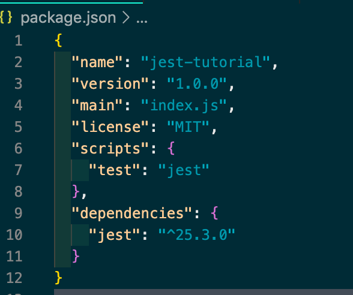
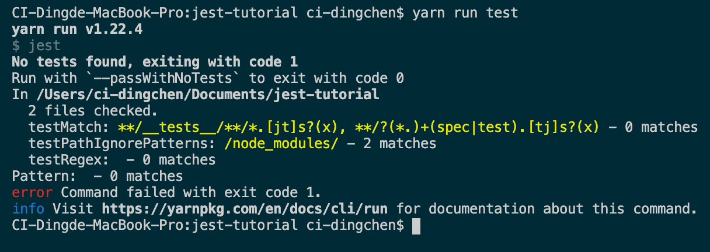
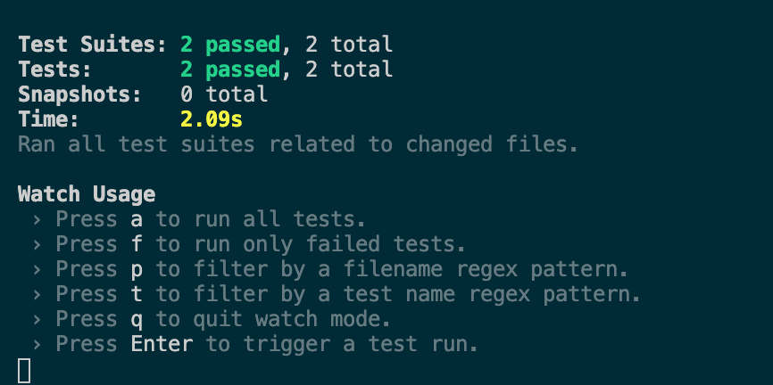
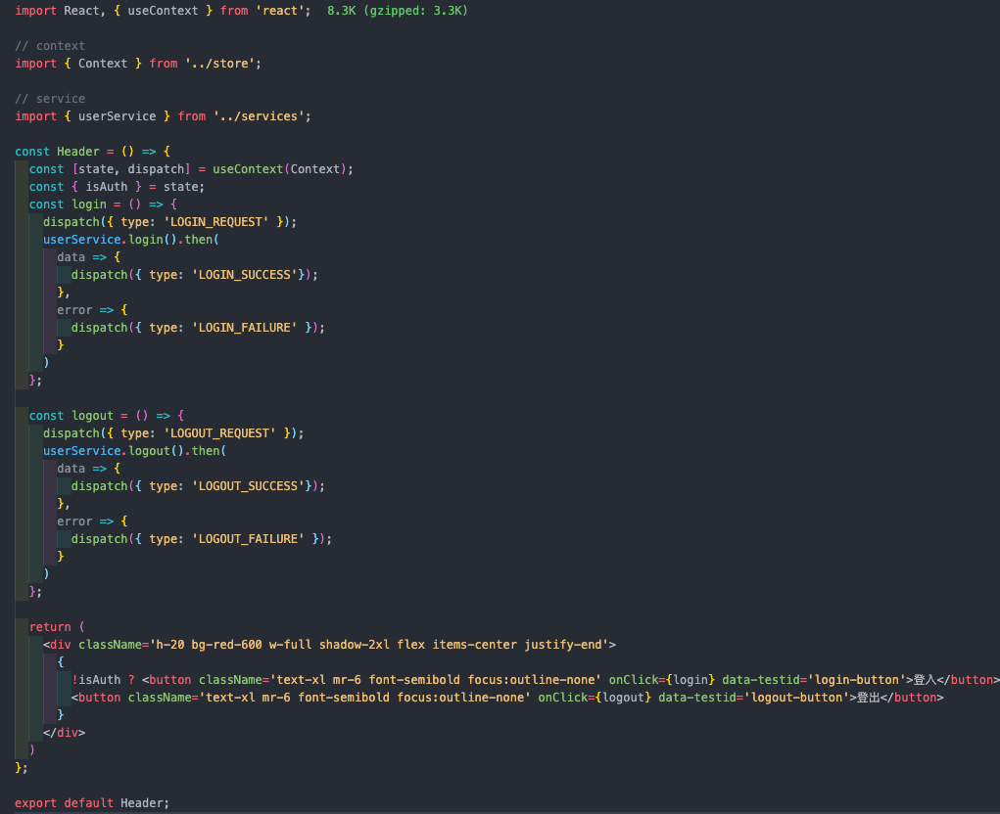
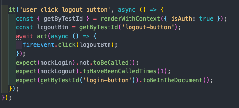

# 測試分享
## 前言
測試不只是可以增加對程式碼的信心，也是變相思考編寫程式的邏輯，在剛開始學習寫測試的時候，是不是常常碰到下列的問題，如果是不用太煩惱，這正是你成長的一個重要過程。  
1.程式邏輯太過複雜，無法測試  
2.A function牽涉太多functions，要實現執行環境太繁瑣  
3. 

---

## 大綱
1. **Jest**
  * ##### 介紹
  * 環境部署
  * Jest Cli簡介
  * descirbe、it(test)、expect
  * setup、teardown
  * 常用matcher
  * mock  
2. **React-testing-library**
  * 介紹
  * 常用API
  * 實戰

3. **vue-unit-test**

---

## 一、Jest
### 1.介紹  
Jest是一套由Facebook開發且維護的單元測試工具，是由Jasmine發展過來的，語法十分相似，且自帶mock function，可協助模擬測試環境，不需額外下載套件，也可直接在測試裡面使用Promise、Async/await，也提供諸多斷言器和覆蓋率報告，還有相當特別的快照(Snapshot)，而且已納入Create-React-App標配的測試工具，Vue cli也可以選擇Jest做為預設測試工具，能有個理由不用他嗎？
### 2.環境部署
  >如果是使用Vue、React等等框架套件的朋友們，套件所提供的create project都可以直接設定完Jest基本環境，所以請直接跳過這一part
  1. 下載Jest  

      <code>npm i -S jest  (yarn add jest)</code>  

  2. package.json新增一個scripts, 如下圖，因為我們並非將jest安裝在全局，因此需要透過npm去執行jest，如果希望直接使用jest cli的話，請在上一點改成npm i -g jest，安裝在全局

        
  3. 執行npm run test，可看到下圖，表示安裝成功，圖中訊息為沒有匹配到任何測試檔案

        

### 3.Jest Cli簡介
  這邊介紹幾個常用的cli語法
  * jest file-name，只執行file-name的檔案進行測試
  * jest -o， 只執行所有尚未commit的檔案進行測試
  * jest -t name-of-spec，執行describe或test的敘述中含有name-of-spec字眼的
  * jest --watch和jest --watchAll，一般來說執行測試之後，想要再次執行需要重下指令，但如果使用這兩個指令，將會保持在測試模式中(如下圖），有任何檔案存檔的時候，會自動執行測試，watch和watchAll差別在預設執行尚未commit的檔案(jest-o)，後者則是執行所有測試檔案

        
### 4.describe、it(test)、expect
  * *describe(name, fn)*, 上面的圖片中，可看到Test Suites字眼，一個describe就是一個suit，扮演著將相同類型的test放在一起，該語法在測試當中並非必要，但可使得測試看起來更有組織化
  * *test(name, fn, timeout?)*, 也可寫成 *it(name, fn, timeout?)*, timeout(毫秒)是選填的，控制多久終止此測試，預設為5秒，每個測試檔案至少擁有一個test function，否則執行指令時會出現錯誤。  
  當你預計寫一個測試，但尚未想到細節時，可透過 *test.todo('textname')* ，當你下次執行測試指令時，可以看到一個todo字眼，就知道之前預計完成的測試案例尚未測試(下圖紫色字眼)

       

### 5.setup、teardown
  * beforeAll  
  執行時間為在每個describe開始之前
  * AfterAll  
  執行時間為在每個describe執行完畢後
  * beforeEach  
  執行時間為在每個test開始之前，這邊有scope問題，如果在describe裡面，則只適用在此describe裡面的每個test，但如果放在global位置，則適用所有test
  * AfterEach  
  執行時間為在每個test執行完畢後，這邊有scope問題，如果在describe裡面，則只適用在此describe裡面的每個test，但如果放在global位置，則適用所有test  
  官方有提供一個範例，讓大家熟悉執行的時間點，程式碼如下，結果不仿先猜猜
        
  <pre>
    beforeAll(() => console.log('1 - beforeAll'));  
    afterAll(() => console.log('1 - afterAll'));
    beforeEach(() => console.log('1 - beforeEach'));
    afterEach(() => console.log('1 - afterEach'));
    test('', () => console.log('1 - test'));
    describe('Scoped / Nested block', () => {
      beforeAll(() => console.log('2 - beforeAll'));
      afterAll(() => console.log('2 - afterAll'));
      beforeEach(() => console.log('2 - beforeEach'));
      afterEach(() => console.log('2 - afterEach'));
      test('', () => console.log('2 - test'));
    });
  </pre>

### 6.常用matcher  
  Jest提供很多Matcher去幫助我們下斷言，以下僅列舉一些較常見的
  * *toBe*  
  常常用在對基本型態的值做檢查，如: expect(3).toBe(3)
  * *toEqual*  
  和toBe相似，都是比對值是否一致，不過通常會是對物件作檢查，如: [1, 2, 3].toEqaul([1, 2, 3])
  * *toBeNull*  
  在javascript當中null和undefined都是falsy值，但兩者還是不一樣的，jest有提供兩個對應的匹配器去區分差異
  * *toBeUndefined*  
  同上  
  * *toThrow*  
  有時候會在例外處理的地方丟出錯誤出來，如: throw new Error('message')，這時候可用這個匹配器去檢查  
  * *toHaveLength* 
  檢查長度可使用這語法

### 7.mock  
我們進行測試的時候，除了測試目標（System Under Test, SUT)之外，SUT執行時所依賴的稱為相依元件（Depended-on Component, DOC），由於測試SUT時，但可能因為DOC的邏輯造成測試變得更加複雜，因此為了解決只專注在SUT的邏輯上和避免浪費無謂的時間在執行DOC上，測試替身(Test Double)是我們的好幫手，測試替身可分成下列五種
  * Dummy： 不包含實作物件，僅作為傳入參數且不會被使用，如：測試登入的邏輯時，登入成功會去執行logger紀錄登入資訊，但logger的執行細節並不是我們在意的，此時就會透過建立一個Dummy，擁有logger的方法，但方法內容為空
  * Stub： 回傳固定值的實作
  * Fake： 接近原始物件但比較簡單的實作
  * Spy： 類似Stub，但會紀錄SUT與他互動的紀錄
  * Mock： 可實現類似Dummy、Stub和Spy的功能  

Jest提供mock api去實作Test Double，一共有三種語法(jest.fn, jest.mock和jest.spyOn)

  * jesy.fn   
  最簡單建立一個Mock物件的方式，每個Mock物件自帶mock屬性，儲存每次執行的相關資訊
  * mock.calls(Array)  
  記錄每次呼叫mock function的傳入參數
  * mock.instances(Array)  
  紀錄透過new語法執行mock function的變數， 如下面的程式碼， mockFn.mock.instances會等於[instanceA]    
  <code>
    const mockFn = jest.fn();
    const instanceA = new mockFn();
  </code>
  * mock.invocationCallOrder(Array)  
    記錄每次mock function的執行次數  
  * mock.results(Array)  
  記錄每次呼叫mock function的回傳值，每次回傳的結果為一個物件{ type, value}，type有三種可能（return, throw, incomplete)，前兩者為順利執行完function，最後一個則是尚未執行完畢; value則是執行結果，當type===incomplete，value為undefined
  
  除了將函數丟入jest.fn()模擬之外，也能直接呼叫空的jest.fn()，並透過mock的其他function定義這個模擬函數執行結果，以下介紹幾個較為常見的：  
  * mockClear  
    將整個mock property清除掉，包括額外賦予mock的property
  * mockReset  
    功能除了mockClear之外，也會將mockImpletation清除掉
  * mockImplementation  
    接受一個函數作為mock的實作函數  
  <pre>const mockFn = jest.fn().mockImplementation(x => 42 + x);</pre>  
  > 縮寫為const mockFn = jest.fn(x => 42 + x)  
  * mockImplementationOnce  
    和mockImplementation一樣，差別在於只會執行一次，下一次將會是預設jest.fn的執行結果，後續指令也有提供once的指令，則不再額外介紹  
  * mockReturnValue(mockReturnValueOnce)  
    希望mock function直接回傳一個值，可透過此語法直接賦予如下：  
    <pre>
    const mockFn = jest.fn();
    mockFn.mockReturnValue(20);  
    mockFn(); // 20
    </pre>
  * mockResolvedValue(mockResolvedValueOnce)  
    mockImpletation加上Promise.resolve的語法，使用的時候記得會變成非同步函數  
  * mockRejectedValue(mockRejectedValueOnce)  
    mockImpletation加上Promise.reject的語法，使用的時候記得會變成非同步函數
* jest.spyOn    
有時候SUT會依賴DOC的回傳結果進行處理，但如果都固定回傳值的話，未來假設DOC的回傳結果型態變更，SUT的Testing會無法檢查出錯誤，因此希望DOC執行原本的邏輯，就會使用jest.spyOn去進行模擬，
  >如果使用jest.spyOn(object, method).mockImplementation(), 其實可以直接使用jest.fn()實現： 
      <pre>
          jest.spyOn(object, methodName).mockImplementation(() => customImplementation) or
          object[method] = jest.fn(() => customImplementation);
      </pre>
* jest.mock
有時候DOC是module，我們一樣可以透過jest.mock模擬，有兩種方式可以進行模擬，模擬的手法差不多，主要差別在於模擬的程式碼是否有獨立出一個檔案，方便其他測試檔案共用
  * 在測試檔案內定義mock module的行為  

  * 在要模擬的檔案旁邊建立一個__mocks__資料夾，在建立一個一樣檔名的檔案
  >如果要模擬的module是存放在node_modules，則在根目錄的地方建立__mocks__，且無需再jest.mock('moduleName'), jest 預設自動mock

>有提供範例程式演示上述介紹mock的說明，有興趣的可至examples/jest-mock查看
---

## 二、React testing library
### 1. 介紹  
React有許多測試套件，但之所以介紹react-testing-library的原因很簡單，像是因為官方推薦、CRA內建套件，加上[Kent C. Dodds](https://kentcdodds.com/blog/)不時會分享testing的文章，幫助我們釐清測試的想法觀念， 其他更詳細的說明可參考[官網](https://testing-library.com/docs/react-testing-library/intro)說明

### 2. 常用API
  * render  
  會渲染整個component成dom，背後是使用ReactDOM.render去實作
  * queries  
  react-testing-library可使用dom-testing-library的相關方法，官方提供了很多找搜尋節點的方式，這邊比較推薦使用getByTestId，因為使用其他方式搜尋結點（by class, by label text等等）可能會造成測試需要隨著class或是text的修改而更新，但如果使用data-testid，即可減低這種情況發生，因為只針對測試所寫的屬性
  * fireEvent  
  可觸發DOM的事件，提供我們模擬click、change發生時後的dom的更新

### 3.實戰  
這邊有一個Header component，裡面根據isAuth來渲染登入或登出的按鈕，點擊登入的按鈕時，isAuth會改為true，反之點擊登出按鈕,isAuth會變為false，詳細的程式碼如下圖  
    
   

在開始測試之後，要先釐清這個component扮演的角色，以及我們預期這個component要實作哪些內容，並整理出我們測試的方向：
  * isAuth在true或false的時候，Header有沒有如預期的執行
  * 點擊按鈕後，登入和登出的按鈕是否會交換
  * userService.login和userService.logout不應該在這邊測試  

所以我們的測試案例程式碼分成登入和登出兩種情境
  * 登入  
  1.渲染未登入的Header component成dom  
  2.確認並取得登入的按鈕   
  3.點擊登入按鈕  
  4.檢查是否執行登入方法  
  5.登入按鈕不存在文本內，反之登出按鈕應存在    
     
  * 登出  
  1.渲染已登入的Header component成dom  
  2.取得登出的按鈕  
  3.點擊登出按鈕  
  4.檢查是否執行登出方法  
  5.檢查登入按鈕存在文本內，反之登出按鈕被移除  
     

從上面的敘述可以發現，我們測試元件的時候，並不在意內部狀態的變更(isAuth)，我們著重在畫面的渲染是否如我們預期，因為UI Component專職在畫面的顯示，內部的資料並不是他的工作之一，但不是說內部資料變化不重要，只是那是屬於其他檔案負責的，相關的測試也應該在那邊進行，更詳細的測試內容可以參考範例(examples/react-simply-login)

---
## 三、

## 參考出處

* [Jest](https://jestjs.io/en/)
* [React testing library](https://github.com/testing-library/react-testing-library)