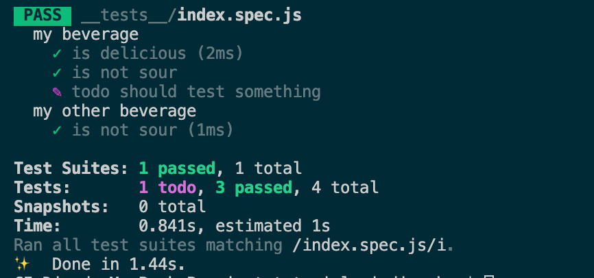

# 測試分享
## 前言
測試不只是可以增加對程式碼的信心，也是變相思考編寫程式的邏輯，在剛開始學習寫測試的時候，是不是常常碰到下列的問題，如果是不用太煩惱，這正是你成長的一個重要過程。  
1.程式邏輯太過複雜，無法測試  
2.A function牽涉太多functions，要實現執行環境太繁瑣  
3. 

---

## 大綱
1. **Jest**
  * 介紹
  * 環境部署
  * Jest Cli簡介
  * descirbe、it(test)、expect
  * setup、teardown
  * 常用matcher
  * mock  
2. **React-test-library**
3. **vue-unit-test**
4. **實戰**
  * Normal function
  * Asynchronous function
  * Api  

---

## 一、Jest
### 1.介紹  
Jest是一套由Facebook開發且維護的單元測試工具，是由Jasmine發展過來的，語法十分相似，且自帶mock function，可協助模擬測試環境，不需額外下載套件，也可直接在測試裡面使用Promise、Async/await，也提供諸多斷言器和覆蓋率報告，還有相當特別的快照(Snapshot)，而且已納入Create-React-App標配的測試工具，Vue cli也可以選擇Jest做為預設測試工具，能有個理由不用他嗎？
### 2.環境部署
  >如果是使用Vue、React等等框架套件的朋友們，套件所提供的create project都可以直接設定完Jest基本環境，所以請直接跳過這一part
  1. 下載Jest  

      <code>npm i -S jest  (yarn add jest)</code>  

  2. package.json新增一個scripts, 如下圖，因為我們並非將jest安裝在全局，因此需要透過npm去執行jest，如果希望直接使用jest cli的話，請在上一點改成npm i -g jest，安裝在全局

        
  3. 執行npm run test，可看到下圖，表示安裝成功，圖中訊息為沒有匹配到任何測試檔案

        

### 3.Jest Cli簡介
  這邊介紹幾個常用的cli語法
  * jest file-name，只執行file-name的檔案進行測試
  * jest -o， 只執行所有尚未commit的檔案進行測試
  * jest -t name-of-spec，執行describe或test的敘述中含有name-of-spec字眼的
  * jest --watch和jest --watchAll，一般來說執行測試之後，想要再次執行需要重下指令，但如果使用這兩個指令，將會保持在測試模式中(如下圖），有任何檔案存檔的時候，會自動執行測試，watch和watchAll差別在預設執行尚未commit的檔案(jest-o)，後者則是執行所有測試檔案

        
### 4.describe、it(test)、expect
  * *describe(name, fn)*, 上面的圖片中，可看到Test Suites字眼，一個describe就是一個suit，扮演著將相同類型的test放在一起，該語法在測試當中並非必要，但可使得測試看起來更有組織化
  * *test(name, fn, timeout?)*, 也可寫成 *it(name, fn, timeout?)*, timeout(毫秒)是選填的，控制多久終止此測試，預設為5秒，每個測試檔案至少擁有一個test function，否則執行指令時會出現錯誤。  
  當你預計寫一個測試，但尚未想到細節時，可透過 *test.todo('textname')* ，當你下次執行測試指令時，可以看到一個todo字眼，就知道之前預計完成的測試案例尚未測試(下圖紫色字眼)

       

### 5.setup、teardown
  * beforeAll  
  執行時間為在每個describe開始之前
  * AfterAll  
  執行時間為在每個describe執行完畢後
  * beforeEach  
  執行時間為在每個test開始之前，這邊有scope問題，如果在describe裡面，則只適用在此describe裡面的每個test，但如果放在global位置，則適用所有test
  * AfterEach  
  執行時間為在每個test執行完畢後，這邊有scope問題，如果在describe裡面，則只適用在此describe裡面的每個test，但如果放在global位置，則適用所有test  
  官方有提供一個範例，讓大家熟悉執行的時間點，程式碼如下
        
  <pre>
    beforeAll(() => console.log('1 - beforeAll'));  
    afterAll(() => console.log('1 - afterAll'));
    beforeEach(() => console.log('1 - beforeEach'));
    afterEach(() => console.log('1 - afterEach'));
    test('', () => console.log('1 - test'));
    describe('Scoped / Nested block', () => {
      beforeAll(() => console.log('2 - beforeAll'));
      afterAll(() => console.log('2 - afterAll'));
      beforeEach(() => console.log('2 - beforeEach'));
      afterEach(() => console.log('2 - afterEach'));
      test('', () => console.log('2 - test'));
    });
  </pre>

### 6.常用matcher
### 7.mock

---